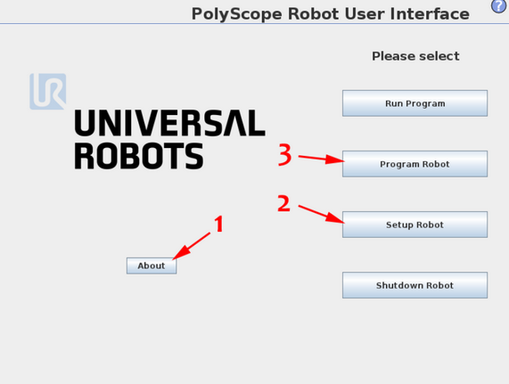
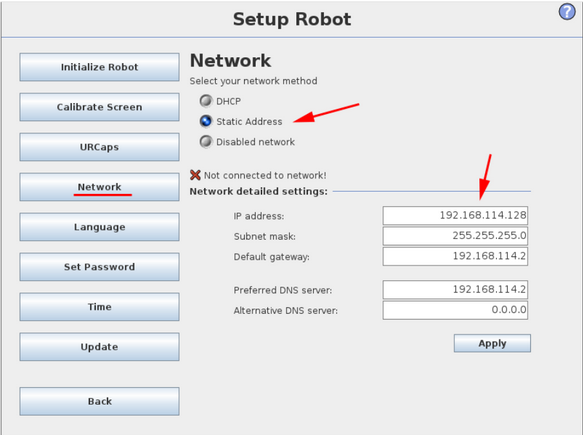
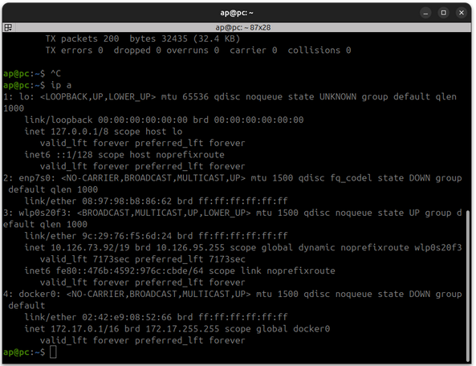
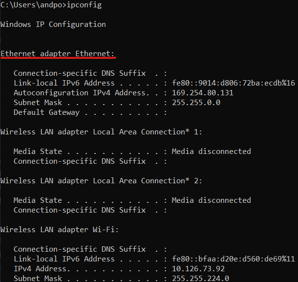
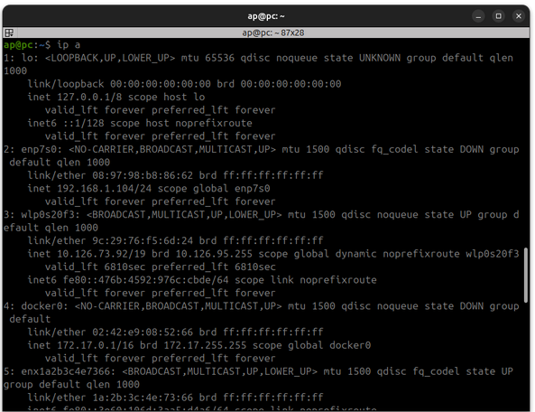

# Setting Up RTDE with a UR Robot on Ubuntu or Windows

## 1. Find the IP Address of the UR Robot
- Navigate to **Setup Robot** on the UR controller.

- To use RTDE, the UR controller **must** be set up with a fixed IP address.

- Your **PC's Ethernet connection** must be on the **same subnet** as the robot.
  - Example: If the robot's IP is **192.168.114.X**, your PC should have an IP like **192.168.114.Y**.

---

## 2. Check the Connection of Your PC 

Run the following command to check your network interfaces:
### Ubuntu
```bash
ip a
```


Look for your **Ethernet connection**. It may look something like this:

```
2: enp7s0: <BROADCAST,MULTICAST,UP,LOWER_UP> mtu 1500 qdisc fq_codel state UP group default qlen 1000
```

- The correct interface typically has the **"fq_codel"** keyword.
- **Ensure that no IP address is assigned** to this connection (i.e., no `inet 192.168.x.x` entry).
- **Note the Ethernet ID** (e.g., `enp7s0`).

### Windows
```bash
ipconfig
```
Look for your **Ethernet connection**. It may look something like this:

```bash
Ethernet adapter Ethernet:

   Connection-specific DNS Suffix  . :
   Link-local IPv6 Address . . . . . : fe80::9014:d806:72ba:ecdb%16
   Autoconfiguration IPv4 Address. . : 169.254.80.131
   Subnet Mask . . . . . . . . . . . : 255.255.0.0
   Default Gateway . . . . . . . . . :
```
- You should look for the network saying "Ethernet"
- As you can see it has an "Autoconfiguration IPv4 Address", this is not we want, we want a static IPv4 Address.


---

## 3. Set Up the IP Address of Your PC
Assign a static IP to your Ethernet interface and bring it up:
### Ubuntu
```bash
sudo ip addr add 192.168.1.X/24 dev <ethernet_id>
sudo ip link set <ethernet_id> up
```

#### Example:
```bash
sudo ip addr add 192.168.1.104/24 dev enp7s0
sudo ip link set enp7s0 up
```

- If the commands run successfully, **there will be no output**.
### Windows

Example:


```bash
netsh interface ipv4 set address name="Ethernet" static 192.168.1.100 255.255.255.0 192.168.1.1
```
---

## 4. Verify That the IP Address Has Changed
Run:

```bash
ip a
```

- You should now see an assigned IP, e.g., `inet 192.168.1.104/24`.

---
Example:


## 5. Check the Connection to the Robot
Ping the robot to confirm the connection:

```bash
ping 192.168.1.X
```

- If successful, you should see a response similar to:

```
64 bytes from 192.168.1.X: icmp_seq=1 ttl=64 time=0.123 ms
```

---

## 6. Check if RTDE is Working
### Check if Ports Are Open
Run:

```bash
nc 192.168.1.X 30002
```

Expected output: A connection confirmation.

### Check the Robot State
Run:

```bash
nc 192.168.1.X 29999
robotmode'
```

Expected output: The **robot mode** based on its current state.

---

This should get your UR robot and RTDE connection properly configured! 🚀
